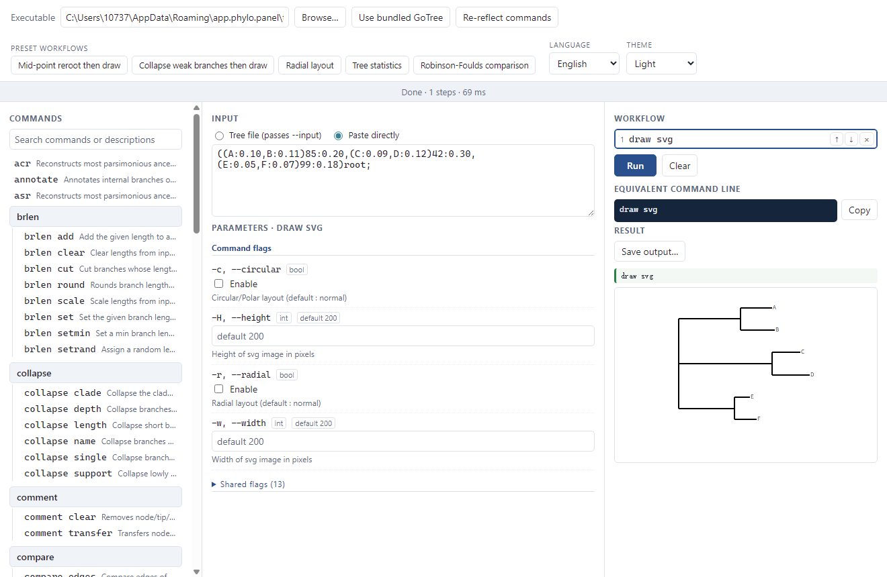
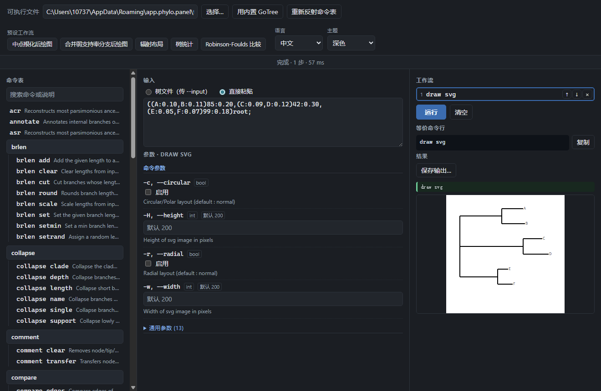

# PhyloPanel

A Windows graphical panel for phylogenetics command-line tools built with
[cobra](https://github.com/spf13/cobra). **GoTree v0.5.2 is embedded** and works out of the
box; the reflection engine is generic, so pointing the panel at any other cobra CLI — GoAlign
among them — turns it into a panel for that tool.

It reflects the whole command tree of whichever executable you point it at, turns every
command into a form with validated fields, chains commands with real OS pipes, and shows
the exact shell line it produced. Nothing is hidden behind the GUI: every workflow you
build can be copied out and run in a terminal unchanged.

**English** · [简体中文](README.zh-CN.md) · [Detailed documentation](docs/en/README.md)

---

## Why this exists

Phylogenetics CLIs are powerful and hard to drive by hand. GoTree alone exposes 82
runnable commands spread over 35 top-level groups, and GoAlign adds dozens more. Chaining
them means remembering which flag each tool wants for input, whether a sub-command
consumes the tree or passes it on, and how to quote a path that contains a space.

PhyloPanel keeps the CLI as the single source of truth — it never re-implements a command —
and removes the typing burden instead:

- **No installation ceremony.** GoTree is embedded in the executable. The download is one
  `.exe`, and it unpacks the tool on first launch.
- **The GUI is generated, not hand-written.** Flags, types and defaults come from
  `<tool> --help`, so an upgraded CLI needs no change in the panel.
- **The shell line is always visible**, so you can learn the CLI from the GUI and leave the
  GUI behind later.

## Features

| | |
|---|---|
| Interface language | 中文 / English, switched at runtime, remembered between launches |
| Colour theme | Light / Dark / Follow system, including the native title bar |
| Command coverage | Every executable command of the target CLI, grouped as a collapsible tree |
| Search | Filter the tree by command id or description |
| Pipelines | Stack commands in order; stdout of step *n* feeds stdin of step *n+1* |
| Presets | One-click multi-step workflows shipped per tool |
| Flag forms | Typed inputs, file pickers for path-like flags, choice menus for enumerated flags |
| Results | Trees, statistics tables, SVG and PNG drawings rendered inline |
| Export | Save output to `.tree` / `.svg` / `.png` / `.txt`, or copy the command line |
| Works with other CLIs | Point it at any cobra binary and it becomes a panel for that binary (reflection only — curated presets exist for GoTree today) |

## What actually ships

| Tool | Embedded in the exe | Presets + positional hints |
|---|---|---|
| **GoTree v0.5.2** | Yes — unpacked on first launch | Yes, curated in `src-tauri/toolpacks/gotree.json` |
| **GoAlign** | No — supply your own `goalign.exe` | **Not yet** — there is no GoAlign tool pack |
| Any other cobra CLI | No | Not unless you add a tool pack |

Reflection itself is generic: every command, flag, type and default shows up regardless of
tool. What a *tool pack* adds is the layer `--help` cannot express — preset workflows, and the
bare positional arguments that some commands require. Driving GoAlign today therefore means
building each step by hand. See [Command coverage](docs/en/command-reference.md).

## Quick start

1. Download the `PhyloPanel-<version>-win-x64.exe` asset from the
   [latest release](https://github.com/ZengZichao/PhyloPanel-Windows/releases/latest) —
   one self-contained file, no installer.
2. Run it. The status line should report
   `GoTree  ·  v0.5.2  ·  82 runnable commands / 35 top-level groups`.
3. In **Input**, either paste a Newick string or type/pick a tree file path.
4. Click a command in **Commands** on the left — it lands in **Workflow**.
5. Press **Run**. The drawing or table appears in **Result**; **Equivalent command line**
   shows what was executed.

To try a pipeline immediately, press one of the preset workflow buttons in the header.

**Requirements:** Windows 10 or 11 and the [WebView2 Runtime](https://learn.microsoft.com/en-us/microsoft-edge/webview2/)
(pre-installed on Windows 11; may need installing on older Windows 10). No Python, no .NET,
no Go, no Node.js.

## Language and theme

Both controls sit at the right end of the header.

- **Language / 语言** swaps the whole interface between Chinese and English instantly and
  stores the choice. With no stored choice it follows the system language.
- **Theme / 主题** offers *Follow system*, *Light* and *Dark*. The selection also recolors
  the Windows title bar, and *Follow system* tracks live changes to the OS setting.

Command names and flag help stay in English by design: they are read from the upstream
tool's own `--help` output rather than from PhyloPanel. Preset workflow names and the
positional-argument hints do have Chinese text, because those are curated by PhyloPanel.
See [Language and theme](docs/en/language-and-theme.md).

## How it works

PhyloPanel is a Tauri v2 application: a Rust backend that owns the processes and a
WebView2 window that renders a TypeScript front end.

It never links against or imports upstream code. Each step is a separate child process,
and the only traffic between them is stdout → stdin, exactly as if you had typed
`gotree reroot midpoint | gotree draw svg` yourself. Child processes are launched with
`CREATE_NO_WINDOW`, so no console flashes on screen.

Flags that merely restate the CLI's own default are dropped before the process starts,
which keeps the produced command line short and the results identical to hand typing.

```
  ┌──────────────┐   spawn    ┌──────────┐   pipe   ┌──────────┐
  │ PhyloPanel   │ ─────────► │ gotree   │ ───────► │ gotree   │
  │  (Rust+UI)   │  argv only │ reroot   │  stdout  │  draw    │
  └──────────────┘            └──────────┘          └──────────┘
```

## Documentation

| Page | Contents |
|---|---|
| [Getting started](docs/en/getting-started.md) | First launch, the two ways to supply a tree, a worked example |
| [Interface tour](docs/en/interface.md) | Every region, control and status message explained |
| [Workflows and pipelines](docs/en/workflows.md) | Multi-step chains, presets, flag rules, positional arguments |
| [Language and theme](docs/en/language-and-theme.md) | What is translated, what is not, where the choice is stored |
| [Command coverage](docs/en/command-reference.md) | How the tree is reflected, GoTree command groups, writing a tool pack for another CLI |
| [Building from source](docs/en/building-from-source.md) | Toolchain, dev loop, release build, running tests |
| [Troubleshooting](docs/en/troubleshooting.md) | Common failures and how to read them |

Chinese versions live in [`docs/zh/`](docs/zh/README.md).

## Interface preview

| English / Light | 中文 / 深色 |
|---|---|
|  |  |

## Building from source

```bash
npm install
npm run build
npx tauri build --no-bundle
# → src-tauri/target/release/PhyloPanel.exe
```

You need a Rust toolchain with the MSVC allocator, the Visual Studio 2022 Build Tools, Node
18+, and the WebView2 Runtime. The full walkthrough, including how the embedded GoTree
binary is produced, is in [Building from source](docs/en/building-from-source.md).

## Repository layout

```
src/                 TypeScript front end
  i18n.ts            zh/en message tables, lookup and DOM localisation
  theme.ts           light / dark / follow-system resolution
  main.ts            panel state, rendering, IPC calls
  controls.ts        per-command flag form builder
  types.ts           shared shapes and the command-tree builder
index.html           static skeleton, marked up with data-i18n keys
src-tauri/
  src/               Rust: reflection, runner, bundling, IPC commands
  toolpacks/         per-tool curation (display name, presets, positional hints)
  tools/gotree.exe   embedded CLI, unpacked on first launch
docs/en, docs/zh     detailed usage documentation, one language per tree
samples/demo.tre     a six-tip Newick tree for trying things out
```

## Licence

PhyloPanel's own source is licensed under the [Apache License 2.0](LICENSE); see also
[NOTICE](NOTICE).

```
Copyright 2026 ZengZichao

Licensed under the Apache License, Version 2.0. See LICENSE for the full text.
```

PhyloPanel is a separate program that starts [GoTree](https://github.com/choishingwan/GoTree)
as a child process and talks to it over pipes — and likewise for any other cobra CLI you
supply yourself, such as [GoAlign](https://github.com/choishingwan/GoAlign). It never links
against or imports their code, so the two stay independently licensed works. Both upstream
tools are GNU GPL v2, and their licence text and copyright remain theirs; the full GPL-2.0
text is reproduced at [LICENSES/GPL-2.0.txt](LICENSES/GPL-2.0.txt). No copy of GoAlign is
included in this repository or in the released executable.

The embedded `src-tauri/tools/gotree.exe` is an unmodified build of GoTree v0.5.2 — only the
linker-injected version string is set, exactly as upstream's own Makefile does. Its
corresponding source is the upstream repository at that tag, and no restriction beyond the
GPL v2 is placed on it by this project.

## Credits

The command-line tools this panel drives are written by [Hing Wan Chang](https://github.com/choishingwan).
